# Solo Alfiles ♝

This repository contains my university project from **2010**, developed during my second programming course (Programación II), 2nd semester. It was submitted in **two parts** and built entirely in **Java**.

The project is a two-player board game called **Solo Alfiles** — a chess variant where only bishops move on the white squares of an 8×8 board. Pieces can always threaten each other, but cannot always capture.

> 📋 The project was an academic assignment and is included here as a record of my early development work.

> 👥 Built in collaboration with **Ismael Rodriguez**.

## Running the Project

Make sure you have **Java** installed. Any version from Java 8 onwards works. You can download it from [adoptium.net](https://adoptium.net).

### Part 1 — Console Interface

1. Navigate to the `part-1/src` folder and compile:

    ```bash
    cd part-1/src
    javac Obligatorio/*.java Consola/*.java -d ../out
    ```

2. Run the program:

    ```bash
    cd ../out
    java Consola.Interfaz
    ```

### Part 2 — Graphical Interface (Swing)

1. Navigate to the `part-2/src` folder and compile:

    ```bash
    cd part-2/src
    javac Dominio/*.java Interfaz/*.java Prueba/*.java -d ../out
    ```

2. Copy the images folder so the UI can find them at runtime:

    ```bash
    cp -r Imagenes ../out/
   
    ```

3. Create the Guardado folder inside out/

    ```bash
    mkdir -p ../out/Guardado
    cd ..
    ```

4. Run the program:

    ```bash
    java -cp out Prueba.Main
    ```

## Overview

The game was built in two deliveries, each adding a layer of complexity.

**Part 1** implemented the core game logic and a console-based interface. The domain layer handled board state, piece movement, turn validation, and game rules. Players interacted entirely through text menus.

**Part 2** replaced the console with a full **Swing graphical interface**, while keeping the domain layer intact and separated from the UI. It added player registration, a game replay feature, a ranking system, data persistence via Java serialization, and a computer player.

## Features

**Part 1 — Console:**

- ♟️ Two-player bishop-only chess game on an 8×8 board
- 🎮 Manual board setup for testing
- 🔁 Game replay from move history
- 👤 Player registration with name and alias
- 📋 Player stats consultation

**Part 2 — Graphical Interface:**

- 🖼️ Full Swing GUI with custom images and backgrounds
- 💾 Data persistence — player and game data saved between sessions via Java serialization
- 🤖 Computer player (single-player mode)
- 🏆 Ranking screen sorted by games played
- 🔁 Game replay viewer
- ✋ Manual board setup via the UI
- 👥 1-player and 2-player modes

## Architecture

The project is structured in clearly separated packages:

- **Dominio** — all game logic: `Sistema`, `Partida`, `Jugada`, `Tablero`, `Casillero`, `Jugador`
- **Interfaz** — all Swing windows and UI components
- **Imagenes** — image assets used by the UI
- **Guardado** — serialized system state saved between sessions
- **Prueba** — entry point (`Main`)

This separation between domain and interface was a core design goal of the course, and implementing it taught us the value of keeping business logic independent from presentation.

## Technologies


- **Java** — Core language, standard library only
- **Java Swing** — GUI framework (part 2)
- **Java Serialization** — Data persistence (part 2)
- **NetBeans** — IDE used at the time of development

## What I would do differently today

- Add unit tests for the domain logic
- Replace Java Serialization with a proper database or JSON persistence
- Fix known UI edge cases — closing the game window while a match is in progress caused unresolved state issues
- Use a proper MVC or event-driven architecture rather than `Observable`
- Replace the computer player's random logic with a basic minimax algorithm

## Preview

> 📸 Screenshot taken on the original Windows environment (2010).
> The game runs on modern macOS but with visual differences due to
> changes in Java's font and rendering system since 2010.

### Part 1

#### Start Game

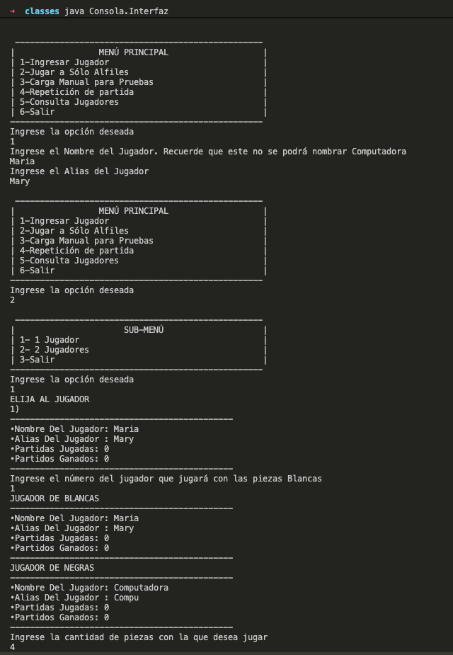

#### Finish Game

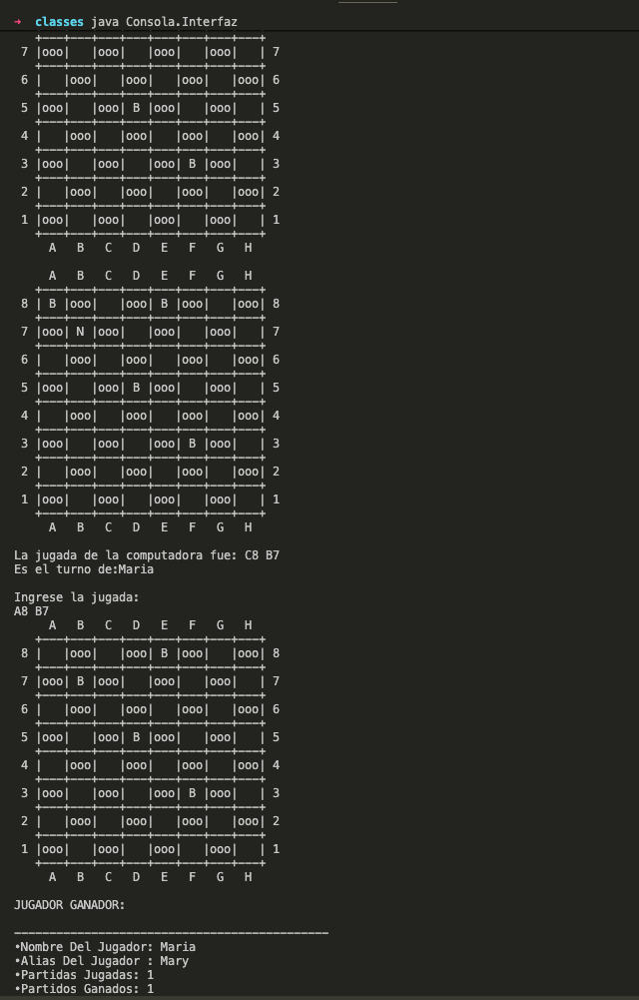

### Part 2

#### Game Manu

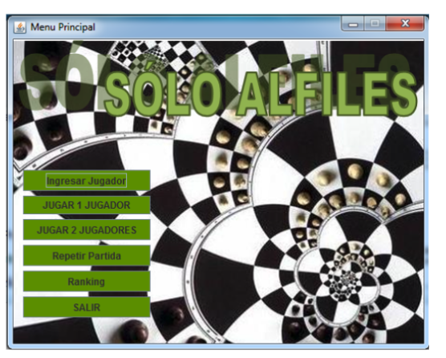

#### Add Player

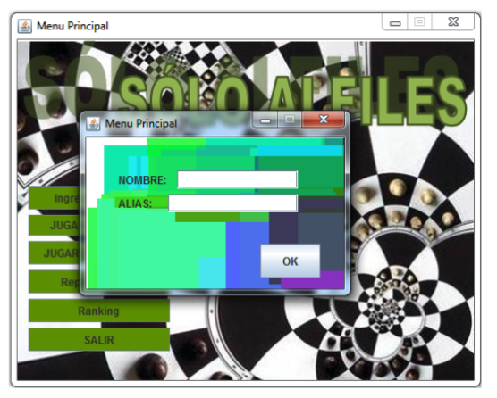

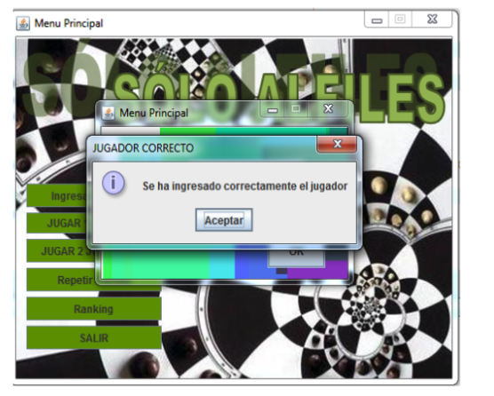

#### Game Match

- **Select Player**

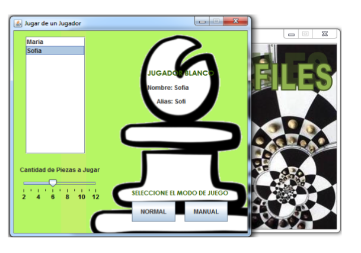

- **Start Game**

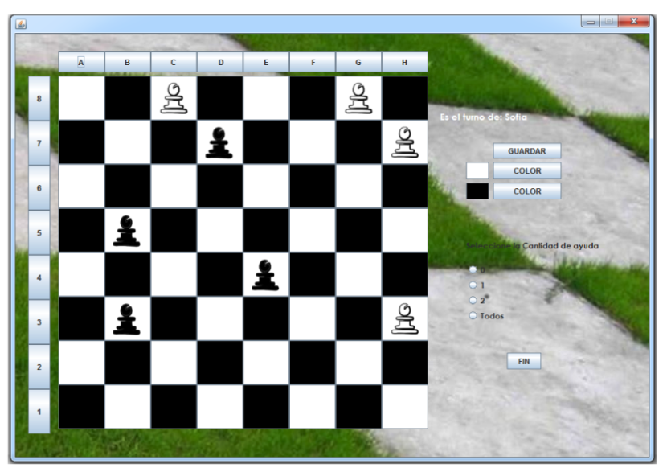

- **Change Color Board**

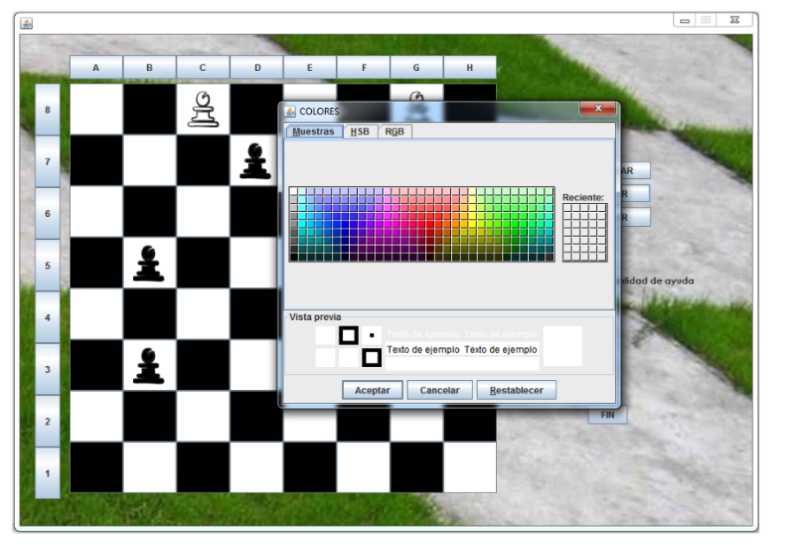

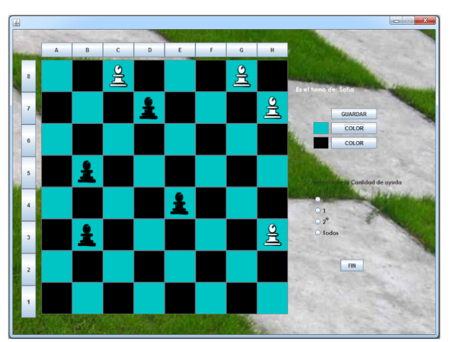

#### Review Match

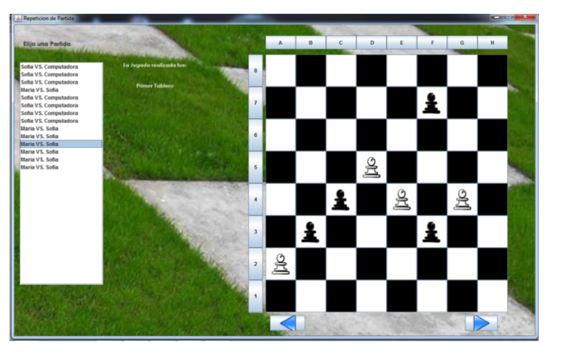

#### Ranking

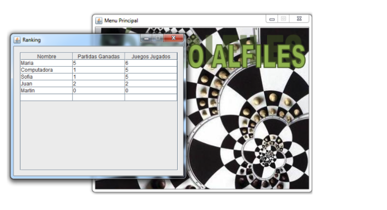

#### Game Exit

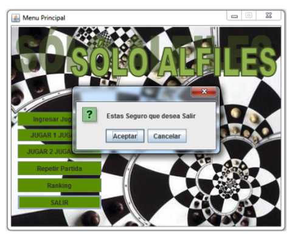
